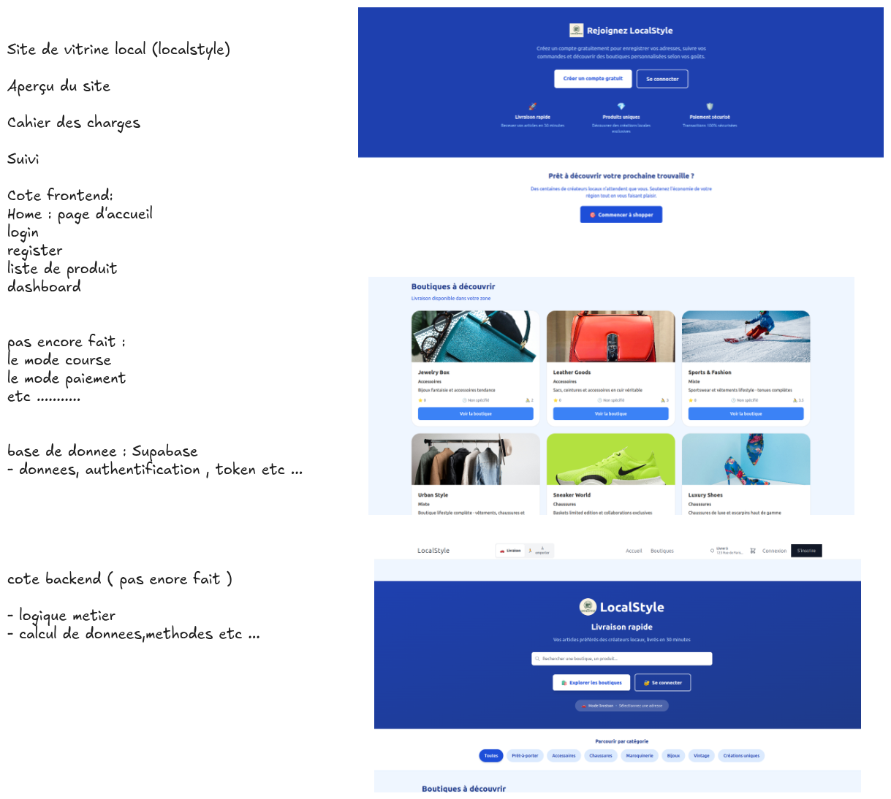

# Projet-Ydays-2025

ALLER DANS LE FRONT END ET TAPER  : npm run dev 

CAHIER DES CHARGES :

CHOIX des technologies :REACT -  NODEJS  - TAILWIND 

REACT : FLEXIBLE , ONE PAGE SIGNLE , DOM REACT

NODEJS : SERVEUR JAVASCRIPT 

CHOIX DE TAILWIND:
- CLASSES DEJA PREPARE 
- ON PEUT CREER DES CLASSES PERSONNALISABLES 
installation : npm install -D tailwindcss@^3.3.0
utiliser la version 3

ARCHITECTURE EN MICROSERVICES: FLEXIBLE POUR UN GROS PROJETS , MOINS DE PROBLEMES,TESTS PLUS SIMPLES 

MICROSERVICES SHOPS, MICROSERVICES PRODUITS , MICROSERVICES PROFILES ETC ....

BACKEND :

